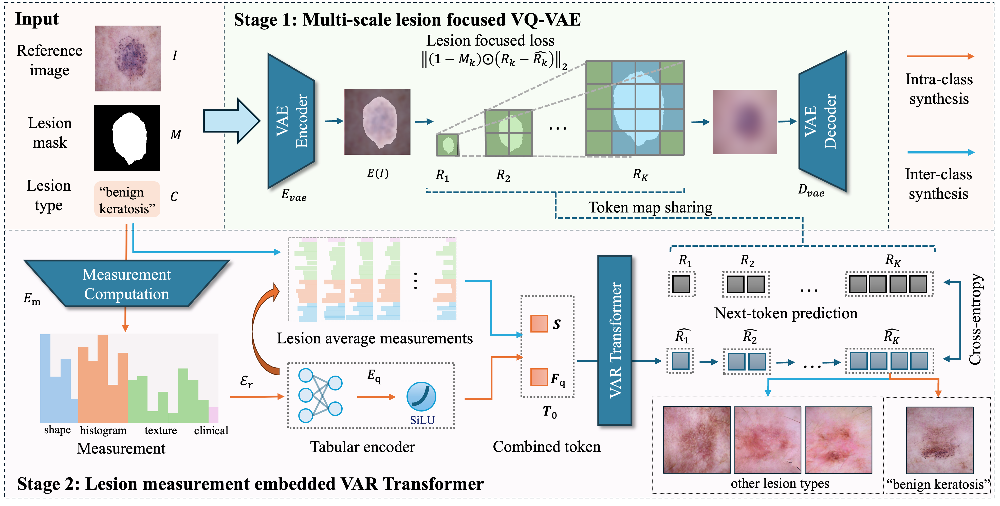
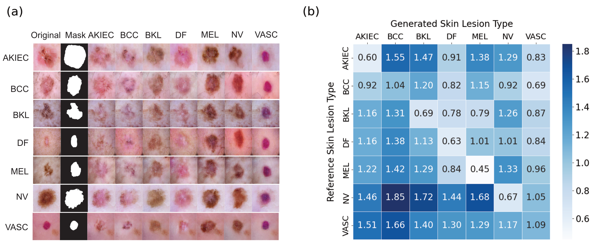

# LF-VAR: Controllable Skin Synthesis via Lesion-Focused Vector Autoregression Model

[](https://opensource.org/licenses/MIT)
[](https://www.python.org/downloads/)
[](https://pytorch.org/)
[](https://conferences.miccai.org/2025/en/)
[](https://research.echosun.top/LF-VAR/)
[](https://arxiv.org/abs/2508.19626)

> **Official PyTorch implementation of "Controllable Skin Synthesis via Lesion-Focused Vector Autoregression Model" presented at MICCAI 2025**

This repository provides the complete implementation of LF-VAR, a novel deep learning framework for generating high-fidelity, clinically relevant synthetic skin images with precise control over lesion characteristics. Our approach combines the power of Vector Quantized Variational Autoencoders (VQVAE) with Visual AutoRegressive Transformers to achieve state-of-the-art performance in skin image synthesis.

<div align="center">
  
  <p><em>Figure 1: The framework of LF-VAR. Our method integrates lesion-focused multi-scale VQ-VAE and measurement scores embedding to achieve controllable skin synthesis.</em></p>
</div>

## 🏆 Key Achievements

- **🎯 State-of-the-Art Performance**: Achieves best overall FID score (0.74) across 7 lesion types
- **📈 Significant Improvement**: 6.3% improvement over previous SOTA methods
- **🎮 Controllable Generation**: Generate skin images with specific lesion characteristics and locations
- **🏥 Clinical Relevance**: Incorporates radiomics features for enhanced medical applicability


## 📋 Abstract

Skin images from real-world clinical practice are often limited, resulting in a shortage of training data for deep-learning models. While many studies have explored skin image synthesis, existing methods often generate low-quality images and lack control over the lesion's location and type. 

To address these limitations, we present **LF-VAR**, a model leveraging quantified lesion measurement scores and lesion type labels to guide the clinically relevant and controllable synthesis of skin images. It enables controlled skin synthesis with specific lesion characteristics based on language prompts. 

We train a multiscale lesion-focused Vector Quantised Variational Auto-Encoder (VQVAE) to encode images into discrete latent representations for structured tokenization. Then, a Visual AutoRegressive (VAR) Transformer trained on tokenized representations facilitates image synthesis. Lesion measurement from the lesion region and types as conditional embeddings are integrated to enhance synthesis fidelity. 

**Our method achieves the best overall FID score (average 0.74) among seven lesion types, improving upon the previous state-of-the-art (SOTA) by 6.3%.** The study highlights our controllable skin synthesis model's effectiveness in generating high-fidelity, clinically relevant synthetic skin images.

## 🏗️ Architecture Overview

The LF-VAR model consists of two main components working in harmony:

### 1. **Multiscale Lesion-Focused VQVAE**
- Encodes skin images into discrete latent representations
- Incorporates lesion-aware features at multiple resolution scales
- Provides structured tokenization for downstream processing

### 2. **Visual AutoRegressive Transformer**
- Generates high-quality skin images based on conditional embeddings
- Integrates lesion types and radiomics features for precise control
- Achieves superior image quality through autoregressive generation


## ✨ Key Features

- **🎯 Controllable Synthesis**: Generate skin images with specific lesion characteristics and locations
- **🔬 Lesion-Focused Design**: Incorporates radiomics features for enhanced clinical relevance
- **🎨 High Fidelity**: Achieves state-of-the-art FID scores across multiple lesion types
- **🏥 Medical Applicability**: Designed specifically for dermatological and medical imaging tasks

<div align="center">
  
  <p><em>Figure 2: Inter-class Synthesis and FID Matrix. (A) Inter-class synthesis results for seven disease classes. The first two columns show the original image and mask, followed by generated images. (B) FID score confusion matrix for inter-class synthesis.</em></p>
</div>

## 🚀 Quick Start

### Prerequisites

- **Python**: 3.8 or higher
- **PyTorch**: 1.12 or higher
- **CUDA**: 11.0 or higher (for GPU acceleration)
- **Memory**: 16GB+ RAM recommended
- **Storage**: 500GB+ free space for datasets and running output

### Installation

1. **Clone the repository**:
```bash
git clone https://github.com/echosun1996/LF-VAR.git
cd LF-VAR
```

2. **Install dependencies**:
```bash
pip install -r requirements.txt
```

3. **Verify installation**:
```bash
python -c "import torch; print(f'PyTorch {torch.__version__} installed successfully')"
```

## 📥 Checkpoints & Pre-trained Models

We provide comprehensive pre-trained models and checkpoints for all components of the LF-VAR framework. 

**🔗 Download Link**: [LF-VAR Checkpoints](https://drive.google.com/drive/folders/1Mrr9wsE5TyFUKMn65TRbyGbR5vv1nqW7?usp=sharing)


## 💻 Usage

### 🎮 Using the Main Script (Recommended)

The repository provides a convenient `main.sh` script for all major operations:

```bash
# Make the script executable
chmod +x main.sh

# Run the main script (interactive menu)
./main.sh

# Or run specific operations directly
./main.sh m    # Main code
./main.sh 2    # Dataset download
./main.sh 9    # GPU verification
./main.sh e    # Evaluation
./main.sh f    # Generate figures
```

### ⚙️ Configuration

The `main.sh` script automatically handles configuration through shell scripts in the `sh/` directory. For custom configurations:

- **Modify shell scripts**: Edit the respective scripts in the `sh/` directory
- **Direct execution**: Run Python scripts directly with your preferred parameters
- **Environment variables**: Set custom paths and configurations as needed

## 📊 Dataset Requirements

The model is designed to work with comprehensive skin lesion datasets containing:

- **🖼️ Skin Images**: High-resolution skin lesion images
- **🎯 Segmentation Masks**: Pixel-level lesion annotations
- **🏷️ Lesion Type Labels**: Categorical classification labels


## 📚 Citation

If you find this work useful in your research, please cite our paper:

```bibtex
@InProceedings{SunJia_Controllable_MICCAI2025,
    author = { Sun, Jiajun and Yu, Zhen and Yan, Siyuan and Ong, Jason J. and Ge, Zongyuan and Zhang, Lei},
    title = { { Controllable Skin Synthesis via Lesion-Focused Vector Autoregression Model } },
    booktitle = {proceedings of Medical Image Computing and Computer Assisted Intervention -- MICCAI 2025},
    year = {2025},
    publisher = {Springer Nature Switzerland},
    volume = {LNCS 15975},
    month = {September},
    page = {128 -- 138}
}
```

## 👥 Authors

**Jiajun Sun**, **Zhen Yu**, **Siyuan Yan**, **Jason J. Ong**, **Zongyuan Ge**, **Lei Zhang**

*Monash University*

## 📄 License

This project is licensed under the MIT License - see the [LICENSE](LICENSE) file for details.


## 📞 Contact & Support

For questions, feedback, or collaboration opportunities:

- **Jiajun Sun**: Jiajun.Sun#monash.edu
- **Zhen Yu**: Zhen.Yu1#monash.edu

## 🙏 Acknowledgments

We extend our gratitude to:

- **MICCAI community** and reviewers for valuable feedback
- **Monash University AIM Lab** for research support
- **Open-source community** for foundational tools and libraries, especially [VAR](https://github.com/FoundationVision/VAR). 

## 🔗 Related Work

This work builds upon and contributes to several research areas:

- **Vector Quantized Variational Autoencoders (VQVAE)**
- **Visual AutoRegressive Transformers (VAR)**
- **Medical Image Synthesis and Generation**
- **Dermatological Image Analysis**
- **Radiomics and Medical Imaging**


---

<div align="center">

**⭐ If this repository helps your research, please consider giving it a star! ⭐**

</div>
